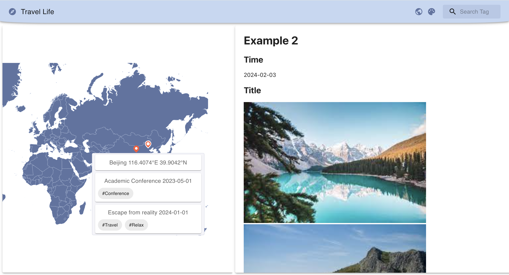
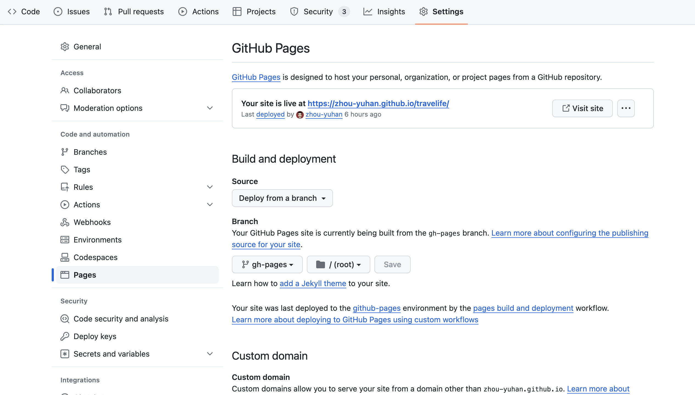

# Travelife

## What is Travelife?
Travelife is a simple application that allows to you record your journeys and possibly share them with others. It consists of two parts: a geomap marking your footprints and a tablet recording your journal. It is a pure frontend application and builds static website based on your journals.


## Get Started

You can install Travelife and record your journeys in a public or private way.

### Private

Considering privacy, it is reasonable to deploy Travelife in a private way. By "private" it means to serve the pages only on your local machine. There are two simple ways to accomplish this.

#### Docker Container (Recommended)

No need to install node.js environment. Just build the docker image and run it.
```bash
cd travelife/
# build the image
docker build -t travelife .
# run the container, use 2222 for ssh
docker run -p 3000:3000 -p 2222:22 --name travelife travelife:latest
```
Now you can visit your site at http://localhost:3000. You can add or update your trips using `scp` or `sftp` by logging into `root@localhost:2222`. The default password is of course `travelife`.

#### Local Deployment

This is actually a development environment. You need to install `npm` or `yarn`.

- Fork this repository and clone it to your local machine
- Run `yarn install`
- Run `yarn start`
- Visit your site at http://localhost:3000

### Public
Travelife is a Create React App so you can always refer to [official deployment guidance](https://create-react-app.dev/docs/deployment) for help. A quick and easy way to deploy Travelife is to use the [GitHub Pages](https://pages.github.com/) service and follow the steps in [official docs](https://create-react-app.dev/docs/deployment#github-pages).

- Fork this repository and clone it to your local machine
- Provide your homepage URL (`https://your-username.github.io/travelife`) in `package.json`
- Run `yarn deploy`
- Go to "Settings" in your forked repository and set "gh-pages" with "/root" in "Pages" option

- Now you can visit your Travelife site at https://your-username.github.io/travelife

Notes:
- Each time you add or update your trips, you need to re-run `yarn deploy` to update your GitHub Pages 
- Everyone would be able to see your trips (this is what *public* means)

## Usage
Travelife contains no backend, which means you cannot add or update your journals by directly interacting with the website (e.g. upload images or texts). It is done by updating the files in `public/` and re-publishing the static site.

### Trip Metadata
The most important file is `trips.json`, which includes the metadata for each trip. This information will be rendered into markers and cards in the geomap. If you want to add a trip, you need to add a JSON object in this file with the following properties:
- title: (Optional) A brief title of your trip
- date: (Optional) Date of your trip 
- coordinates: (Mandatory) The coordinations of your destination in `[longitude (E), latitude (N)]` format. This helps Travelife render a marker on the geomap. Trips with the __same coordinates__ will be aggregated into the __same marker__
- location: (Mandatory) The location of your trip
- tags: (Optional) You can add an array of tags to your trip
- notes: (Optional) The file path of the corresponding journal.

Check `public/trips.json` as an example.

### Journal

You can write a journal for a trip. Travelife adopts Markdown syntax for journals, which is simple by effective. To control the width and height of images, you may want to insert images like this:
```html

```
After finishing a `journal.md`, put it anywhere you like in `public/` and fill the path in the `notes` field in the corresponding trip metadata. Check `public/examples/` as examples.

## Contribution

As I focus on computer network systems, frontend development is apparently not my expertise. I developed this application because existing ones with similar functionalities are not as I expected, and I love to build things on my own. In fact, I have almost no knowledge of HTML, CSS, or JavaScript, and I developed Travelife entirely by interacting with ChatGPT and intensive googling. Therefore, there must be tons of bad practices in my code and a lot of room for improvement. So any contributions and suggestions are welcomed and appreciated.

Currently, some further improvements are scheduled:
- [ ] Show geographic information on geomap hover
- [ ] Make use of the search field